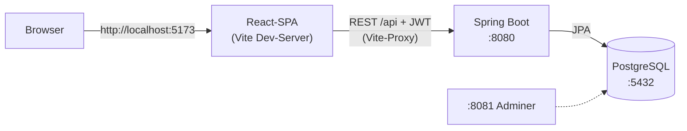

# MediMinder

MediMinder ist eine Webanwendung, mit der Familien die häusliche Pflege eines Angehörigen gemeinsam koordinieren. Es gibt einen Medikationsplan mit Einnahme-Bestätigung, einen geteilten Termin- und Aufgabenkalender mit Übernahme-Funktion und als Startscreen die Tagesansicht "Heute". Die UX-Kernidee sind rollenbasierte Sichten: Die Hauptpflegeperson (ADMIN) pflegt Medikationsplan und Mitglieder, weitere Angehörige (MEMBER) bestätigen Einnahmen und übernehmen Termine. Das UI blendet aus, was die Rolle nicht darf, der Server prüft es zusätzlich. Wichtigstes Feature ist der Doppelgabe-Schutz: Bestätigte Einnahmen sind sofort für alle sichtbar, und wenn zwei Personen gleichzeitig bestätigen, gewinnt genau eine. Die andere sieht den Hinweis "Bereits von ... um ... bestätigt" statt einer Doppelgabe.

> Hochschulprojekt (Modul "Projekt Softwareentwicklung & UX"), Einzelabgabe von Arthur Rode. Es werden nur fiktive Testdaten verwendet. Aus Datenminimierungsgründen sind bewusst keine Diagnose-Felder modelliert, da es sich um Gesundheitsdaten nach Art. 9 DSGVO handelt.

## Architektur



Der Doppelgabe-Schutz ist zweifach abgesichert. Ein Unique-Constraint auf `(schedule, date)` verhindert doppelte Tages-Events, und die Bestätigung selbst ist ein atomares `UPDATE ... WHERE status = 'OPEN'`. Wer verliert, bekommt HTTP 409 mit Name und Uhrzeit. Das Frontend pollt die Tagesansicht alle 30 Sekunden, auf WebSockets wurde im MVP bewusst verzichtet.

```
backend/            Spring Boot REST-API (Geschäftsregeln, Rollen, Seed-Daten)
frontend/           React-SPA, Mobile-First (max. 480 px)
docker-compose.yml  PostgreSQL + Adminer
```

## Technologien

- Frontend: React 18.3, TypeScript 5.6, Vite 5.4, React Router 6.30
- Backend: Spring Boot 3.5.5 (Java 21), Spring Data JPA, Bean Validation, Spring Security mit JJWT 0.12 (BCrypt + JWT)
- Datenbank: PostgreSQL 16 im Docker-Container, H2 für Tests
- Build: Maven-Wrapper, npm, docker compose

## Starten

Voraussetzungen: Docker, Java 21+, Node 20+. Weitere Konfiguration ist nicht nötig, für die Entwicklung gelten Defaults (überschreibbar per `.env`, siehe `.env.example`).

```bash
# 1. Datenbank
docker compose up -d

# 2. Backend (http://localhost:8080), wartet ggf. kurz auf die DB
cd backend && ./mvnw spring-boot:run
# bereit, wenn im Log steht: "Demo-Daten angelegt: Pflegekreis 'Familie Rode' ..."

# 3. Frontend (http://localhost:5173)
cd frontend && npm install && npm run dev
```

Dann http://localhost:5173 öffnen und mit einem Demo-Login anmelden. `docker compose down -v` setzt die Demo-Daten zurück, beim nächsten Start wird neu geseedet.

## Demo-Logins

| E-Mail | Passwort | Rolle |
|---|---|---|
| sabine@demo.de | `demo1234` | ADMIN |
| jonas@demo.de | `demo1234` | MEMBER |

Beide gehören zum Pflegekreis "Familie Rode" mit Patient Werner (81). Angelegt sind Ramipril 5 mg (08:00 und 18:00), Metformin 500 mg (12:00), ein unbesetzter Kardiologen-Termin und die Aufgabe "Rezept anfordern". Die Morgengabe ist schon von Sabine bestätigt. Ein Drehbuch für die Live-Demo, auch für das Doppelgabe-Szenario mit zwei Browsern, steht in [DEMO.md](DEMO.md).

## Tests

```bash
cd backend && ./mvnw test
```

27 Tests decken die kritischen Stellen ab: idempotente Tagesplan-Generierung samt Überfällig-Logik, den Confirm-Konfliktfall (409, Bestand wird nur einmal reduziert) und die Berechtigungen (403 für MEMBER und Nicht-Mitglieder).

## Weitere Doku

- [SCOPE.md](SCOPE.md): Abweichungsprotokoll, geplant vs. umgesetzt, bewusste Vereinfachungen
- [STATUS.md](STATUS.md): Umsetzungsstand mit Abnahmetest-Protokoll und offenen Punkten
- [DEMO.md](DEMO.md): Schritt-für-Schritt-Drehbuch für die Live-Demo
